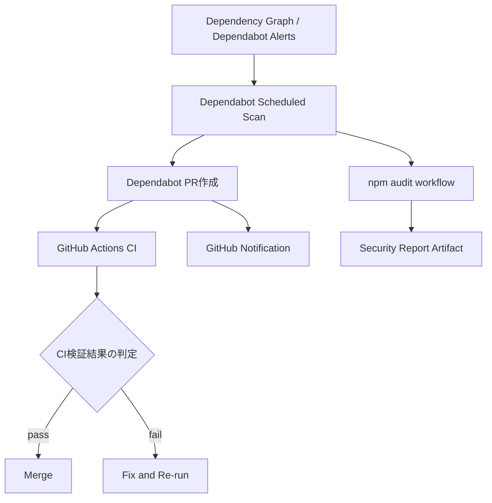

# Dependabot + GitHub Actions 脆弱性検知/自動PR化 実装計画書

**作成日**: 2026-07-17
**ステータス**: 合意版
**対象リポジトリ**: toeic-study-manager
**目的**: 依存パッケージの脆弱性を自動検知し、修正PRを継続的に自動生成してセキュアな状態を維持する。

---

## 1. 背景と課題

### 1.1 現在の課題
- 使用中パッケージの脆弱性発生時に、検知・通知・更新作業が手動になっている。
- 定期的なアップデート運用が標準化されておらず、対応遅延のリスクがある。

### 1.2 解決方針
- Dependabot により依存関係更新PRを自動生成する。
- GitHub Actions により、PR品質担保（lint/test/build）とセキュリティ監査を自動化する。
- 更新PRの優先順位付け・通知基準を定義し、運用負荷を低減する。

---

## 2. スコープ

### 2.1 対象
- Node.js/npm 依存関係（`package.json`, `package-lock.json`）
- GitHub Actions ワークフロー依存関係（`uses:` のアクションバージョン）
- 脆弱性検知、PR作成、CI検証、GitHub通知

### 2.2 非対象
- アプリ機能コードの改修
- ランタイムWAFやインフラ脆弱性対策
- 依存関係以外（OS/ミドルウェア）の脆弱性管理

---

## 3. 目標 (Success Metrics)

- 脆弱性検知からPR作成までを自動化（手動起票ゼロ）。
- Dependabot PR の 100% が CI（lint/test/build）を自動実行。

---

## 4. 全体アーキテクチャ

### 4.1 コンポーネント
- `dependabot.yml`
  - npm と github-actions エコシステムの更新設定
  - スケジュール、PR上限、ラベル、コミットメッセージ規約
  - 役割:
    - 依存関係更新の「起点」を担う設定ファイル
    - どの依存を、どの頻度で、どの粒度でPR化するかを制御する
  - 入力:
    - `package.json` / `package-lock.json`
    - `.github/workflows/*.yml` の `uses:`
  - 出力:
    - Dependabotによる更新PR
    - GitHubの依存関係更新通知
- `security-audit.yml` (GitHub Actions)
  - 定期実行 + 手動実行
  - `npm audit --audit-level=high` 実行、結果保存
  - 役割:
    - 脆弱性の「監査」を定期実行し、監査結果を履歴化する
    - High以上の脆弱性検出時に失敗ステータスを返して注意喚起する
  - 入力:
    - リポジトリの依存関係
    - 実行トリガー（schedule / workflow_dispatch）
  - 出力:
    - GitHub Actionsの成功/失敗ステータス
    - 監査レポートartifact
- `ci.yml` (GitHub Actions)
  - 新規作成する標準CI（lint/test/build）
  - 役割:
    - 更新PRを含む全PRが品質基準を満たすかを検証する「品質ゲート」
    - マージ可否判断に必要なCI結果を提供する
  - 入力:
    - pull_request（Dependabot PR含む）
  - 出力:
    - lint/test/build のチェック結果
    - 失敗時のログ（レビュー時の原因特定に使用）

---

## 5. 実装タスク分解

## 5.1 フェーズ1: 設計確定

### タスク
1. 運用ポリシー決定
- Dependabot PRの運用方針（優先順位、通知、トリアージ）を定義する
2. 通知先定義
- GitHub通知のみ
3. ブランチ保護ルールとの整合確認
- 必須ステータスチェック、自動マージ無効化

### 成果物
- 運用ポリシー表
- ブランチ保護要件チェックリスト

### Acceptance Criteria
- 通知チャネルがGitHub通知のみで統一されている。

---

## 5.2 フェーズ2: Dependabot設定

### タスク
1. `.github/dependabot.yml` を追加
- npm: 週次（例: 毎週月曜 09:00 JST）
- github-actions: 週次
- `open-pull-requests-limit` 設定（例: 10）
- `labels`（`dependencies`, `security`）を全Dependabot PRに付与
- `commit-message` prefix（`chore(deps)`）
2. グルーピング方針
- 開発依存（devDependencies）をまとめる
- 本番依存は分離（影響範囲を把握しやすくする）
3. Ignore戦略
- 破壊的変更を含むメジャー更新の一時除外可否を定義

### 成果物
- `.github/dependabot.yml`

### Acceptance Criteria
- Dependabotがnpm/github-actions両方でPRを生成できる。
- PRに想定ラベル・タイトル規約が適用される。

---

## 5.3 フェーズ3: GitHub Actions (監査/検証)

### タスク
1. 標準CIワークフロー追加 (`.github/workflows/ci.yml`)
- `pull_request` をトリガー
- Nodeセットアップ、`npm ci`、`npm run lint`、`npm test`、`npm run build`
- Dependabot PRを含むすべてのPRで同一品質ゲートを実行
2. 依存脆弱性監査ワークフロー追加 (`.github/workflows/security-audit.yml`)
- `schedule` + `workflow_dispatch`
- Nodeセットアップ、`npm ci`、`npm audit --audit-level=high`
- High以上の脆弱性検出時にジョブ失敗
- 監査レポートをartifact保存
3. Dependabot PRとの連携確認
- Dependabot起点PRでも `ci.yml` が必ず実行されることを確認
- 実行時間最適化（キャッシュ、並列）
4. 失敗時通知
- GitHub Checks のみ

### 成果物
- `.github/workflows/ci.yml`
- `.github/workflows/security-audit.yml`
- Dependabot PRでのCI実行確認ログ

### Acceptance Criteria
- 定期監査が動作し、結果が履歴として参照できる。
- Dependabot PRでCIが未実行になるケースがない。

---

## 6. 設定仕様（提案）

### 6.1 Dependabot設定パラメータ案
- `package-ecosystem`: `npm`, `github-actions`
- `directory`: `/`
- `schedule.interval`: `weekly`
- `schedule.day`: `monday`
- `schedule.time`: `00:00` (UTC) ※JST 09:00
- `open-pull-requests-limit`: `10`
- `labels`: `dependencies`, `security`（全Dependabot PR）
- `versioning-strategy`: `increase`

### 6.2 CIゲート案
- 必須チェック
  - `.github/workflows/ci.yml` の Lint
  - `.github/workflows/ci.yml` の Unit Test
  - `.github/workflows/ci.yml` の Build
- 追加チェック
  - `npm audit`（High以上でfail）
  - 依存ライセンスチェック（必要なら後続導入）

---

## 7. テスト計画

## 7.1 テスト観点
1. Dependabot起票検証
- テスト用ブランチで依存を旧版化し、PR自動作成を確認
2. CI連携検証
- Dependabot PRでlint/test/buildが自動起動する
3. 監査失敗検証
- 意図的に脆弱パッケージを導入した検証ブランチで`npm audit` failを確認

## 7.2 受け入れテストケース
- TC-01: npm依存更新PRが週次で作成される
- TC-02: github-actions更新PRが週次で作成される
- TC-03: Dependabot PRに `dependencies` と `security` ラベルが付与される
- TC-04: High脆弱性検出時に `security-audit` が失敗し通知される

---

## 8. デプロイ/適用手順

1. `dependabot.yml` を main にマージ
2. `security-audit.yml` を main にマージ
3. ブランチ保護ルールを更新
4. Auto-mergeを無効化
5. 初回2週間は毎日監視、誤検知・過検知を調整

---

## 9. リスクと対策

- リスク: PR過多で運用負荷増大
- 対策: グルーピング、PR上限、優先度ルールの明確化

- リスク: 互換性破壊（特にmajor）
- 対策: majorはリリースノート確認 + 必要時ステージング検証

- リスク: CI時間増加
- 対策: キャッシュ最適化、Dependabot PR向け軽量ジョブ分離

- リスク: false positive / noisy alert
- 対策: 監査閾値の調整、例外ルールと期限付きignore

---

## 10. 体制と役割

- Security Owner
  - アラートトリアージ、重大度判定
- Maintainer
  - Dependabot設定・ワークフロー保守

---

## 11. 完了定義 (Definition of Done)

- mainブランチでDependabot PRが定期生成される。
- 脆弱性監査ワークフローが定期実行される。
- Dependabot PRはCI必須チェックを通過しない限りマージ不可。
- 自動マージが無効化されている。
- 本設計書に定義した運用方針と検証要件が実装設定に反映されている。

---

## 12. 補足

- Dependabot自体が「脆弱性対応PR」を作成できるため、GitHub Actionsは主に「検証」「監査」「通知」「マージ制御」を担当する。

---

## 13. 運用手順チェックリスト（追記）

### 13.1 リポジトリ設定（GitHub画面）

- [x] Settings > Branches > Branch protection rules で `main` の保護ルールを設定
- [x] 必須ステータスチェックに CI の各ジョブ（Lint / Unit Test / Build）を追加
- [x] 「必須チェックが成功するまでマージ不可」を有効化
- [x] Auto-merge を無効化（レビュー + CI通過を必須に統一）
- [x] 管理者にも保護ルールを適用するかを運用ポリシーに合わせて決定

### 13.2 初回デプロイ後の動作確認

- [x] `security-audit.yml` を `workflow_dispatch` で手動実行
- [x] `npm-audit-report` artifact が保存されることを確認
- [x] High以上の脆弱性がある場合にジョブが失敗することを確認
- [x] Dependabotの初回PRでラベル `dependencies` / `security` が付与されることを確認
- [x] Dependabot PRで `ci.yml`（Lint / Unit Test / Build）がすべて実行されることを確認

### 13.3 初回2週間の運用監視

- [ ] PR件数が過多の場合、Dependabotグルーピング粒度またはPR上限を調整
- [ ] noisy alert が多い場合、監査閾値とignore方針（期限付き）を再評価
- [ ] 毎週のトリアージ結果を記録（対応済み / 保留 / 例外）

### 13.4 受け入れ判定（運用）

- [ ] TC-01: npm依存更新PRが週次で作成される
- [ ] TC-02: github-actions更新PRが週次で作成される
- [ ] TC-03: Dependabot PRに `dependencies` と `security` ラベルが付与される
- [ ] TC-04: High脆弱性検出時に `security-audit` が失敗する
