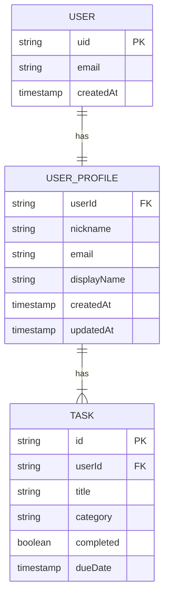

# ニックネーム設定機能 - 詳細設計書

**作成日**: 2026年5月23日
**ステータス**: 設計完了
**バージョン**: 1.0.0

---

## 1. 機能概要

ユーザーが Header コンポーネント内のユーザー情報エリアからニックネーム（最大20文字）を設定・変更できる機能です。

### 1.1 特徴
- **リアルタイム保存**: 編集後、即座に Firestore に同期
- **フォールバック表示**: 未設定時は displayName または email を表示
- **柔軟な文字種**: 特殊文字を許容（エモジ含む）
- **簡単な編集体験**: Header 内からワンクリックでモーダルを開く

---

## 2. API・Firestore 操作定義

### 2.1 ニックネーム取得メソッド

```typescript
// メソッド署名
static async getNickname(userId: string): Promise<string | null>
```

**説明**: Firestore users/{userId}/profile コレクションから nickname フィールドを取得

**リクエスト**:
- `userId: string` - 認証済みユーザーの UID

**レスポンス**:
- `Promise<string | null>` - ニックネーム文字列、または未設定時は null

**エラーハンドリング**:
```typescript
try {
  const nickname = await FirestoreService.getNickname(userId);
} catch (error) {
  if (error instanceof FirebaseError) {
    if (error.code === 'permission-denied') {
      console.error('Permission denied: Cannot access user profile');
    } else if (error.code === 'not-found') {
      // ドキュメントが存在しない場合は null を返す
      return null;
    }
  }
  throw error;
}
```

**実装例**:
```typescript
static async getNickname(userId: string): Promise<string | null> {
  try {
    const profileRef = doc(db, `users/${userId}/profile`, 'userInfo');
    const snapshot = await getDoc(profileRef);

    if (!snapshot.exists()) {
      return null;
    }

    const data = snapshot.data();
    return data?.nickname || null;
  } catch (error) {
    console.error('Failed to fetch nickname:', error);
    throw error;
  }
}
```

---

### 2.2 ニックネーム更新メソッド

```typescript
// メソッド署名
static async updateNickname(userId: string, nickname: string): Promise<void>
```

**説明**: Firestore users/{userId}/profile の nickname フィールドを更新

**リクエスト**:
- `userId: string` - 認証済みユーザーの UID
- `nickname: string` - 新規ニックネーム（1～20文字、特殊文字許容）

**レスポンス**:
- `Promise<void>` - 更新成功時に解決

**バリデーション（クライアント側）**:
1. 長さ: 1～20文字
2. 空文字不可
3. 先頭・末尾の空白を自動削除
4. 許容文字: 英数字、日本語、絵文字、スペース、 `-`, `_`, `.`

**エラーハンドリング**:
```typescript
try {
  await FirestoreService.updateNickname(userId, nickname);
} catch (error) {
  if (error instanceof FirebaseError) {
    if (error.code === 'permission-denied') {
      console.error('Permission denied: Cannot update nickname');
    } else if (error.code === 'failed-precondition') {
      console.error('Document does not exist');
    }
  }
  throw error;
}
```

**実装例**:
```typescript
static async updateNickname(userId: string, nickname: string): Promise<void> {
  const trimmedNickname = nickname.trim();

  // バリデーション
  if (trimmedNickname.length === 0 || trimmedNickname.length > 20) {
    throw new Error('Nickname must be between 1 and 20 characters');
  }

  try {
    const profileRef = doc(db, `users/${userId}/profile`, 'userInfo');
    await setDoc(
      profileRef,
      {
        nickname: trimmedNickname,
        updatedAt: Timestamp.now()
      },
      { merge: true }
    );
  } catch (error) {
    console.error('Failed to update nickname:', error);
    throw error;
  }
}
```

---

### 2.3 ユーザープロファイル取得メソッド（拡張）

```typescript
// メソッド署名
static async getUserProfile(userId: string): Promise<UserProfile | null>
```

**説明**: ユーザーの統合プロファイル情報（nickname を含む）を取得

**リクエスト**:
- `userId: string` - 認証済みユーザーの UID

**レスポンス**:
```typescript
interface UserProfile {
  userId: string;
  nickname: string | null;
  email: string | null;
  displayName: string | null;
  createdAt: Date;
  updatedAt: Date;
}
```

**実装例**:
```typescript
static async getUserProfile(userId: string): Promise<UserProfile | null> {
  try {
    const profileRef = doc(db, `users/${userId}/profile`, 'userInfo');
    const snapshot = await getDoc(profileRef);

    if (!snapshot.exists()) {
      return null;
    }

    const data = snapshot.data();
    return {
      userId,
      nickname: data?.nickname || null,
      email: data?.email || null,
      displayName: data?.displayName || null,
      createdAt: data?.createdAt?.toDate() || new Date(),
      updatedAt: data?.updatedAt?.toDate() || new Date()
    };
  } catch (error) {
    console.error('Failed to fetch user profile:', error);
    throw error;
  }
}
```

---

## 3. データモデル

### 3.1 Firestore スキーマ

```
users/
└── {userId}/
    ├── tasks/ (既存)
    │   └── {taskId}
    ├── profile/ (新規追加)
    │   └── userInfo
    │       ├── nickname (string, 1-20文字)
    │       ├── email (string)
    │       ├── displayName (string)
    │       ├── createdAt (Timestamp)
    │       └── updatedAt (Timestamp)
    └── ... (他のコレクション)
```

### 3.2 フィールド定義

| フィールド名 | 型 | 必須 | 説明 | 例 |
|---|---|---|---|---|
| `nickname` | string | ❌ | ユーザーのニックネーム | "田中太郎" |
| `email` | string | ✅ | ユーザーのメールアドレス | "user@example.com" |
| `displayName` | string | ❌ | Firebase 認証から連携 | "Taro Tanaka" |
| `createdAt` | Timestamp | ✅ | プロファイル作成日時 | 2026-05-23T10:00:00Z |
| `updatedAt` | Timestamp | ✅ | プロファイル更新日時 | 2026-05-23T10:30:00Z |

### 3.3 ER図（Mermaid形式）



### 3.4 TypeScript 型定義

```typescript
// types/index.ts に追加

export interface UserProfile {
  userId: string;
  nickname: string | null;
  email: string | null;
  displayName: string | null;
  createdAt: Date;
  updatedAt: Date;
}

export interface FirebaseUserProfile {
  userId?: string;
  nickname?: string;
  email?: string;
  displayName?: string;
  createdAt?: Timestamp;
  updatedAt?: Timestamp;
}

// ニックネーム変更リクエスト型
export interface UpdateNicknameRequest {
  nickname: string;
}

// ニックネーム変更レスポンス型
export interface UpdateNicknameResponse {
  success: boolean;
  nickname: string | null;
  message?: string;
}
```

---

## 4. コンポーネント設計

### 4.1 Header.tsx - 拡張設計

**変更点**:
- ユーザー情報エリアにニックネーム表示
- ニックネーム部分をクリック可能にする
- モーダル開閉の state を追加

```tsx
'use client';

import { useState, useEffect } from 'react';
import { useAuth } from '@/hooks/useAuth';
import type { Goal, UserProfile } from '@/types';
import { useRouter } from 'next/navigation';
import { FirestoreService } from '@/lib/dataService';
import NicknameEditModal from '@/components/NicknameEditModal';

interface HeaderProps {
  completedTasks: number;
  totalTasks: number;
  completionRate: number;
  goals: Goal | null;
  onSaveGoals: (goals: Goal) => void;
}

export default function Header({
  completedTasks,
  totalTasks,
  completionRate,
  goals,
  onSaveGoals
}: HeaderProps) {
  const { user, signOut } = useAuth();
  const router = useRouter();
  const [userProfile, setUserProfile] = useState<UserProfile | null>(null);
  const [isNicknameModalOpen, setIsNicknameModalOpen] = useState(false);
  const [isLoading, setIsLoading] = useState(false);

  // ユーザープロファイル取得
  useEffect(() => {
    if (user?.uid) {
      loadUserProfile();
    }
  }, [user?.uid]);

  const loadUserProfile = async () => {
    if (!user?.uid) return;

    try {
      setIsLoading(true);
      const profile = await FirestoreService.getUserProfile(user.uid);
      setUserProfile(profile);
    } catch (error) {
      console.error('Failed to load user profile:', error);
    } finally {
      setIsLoading(false);
    }
  };

  const handleLogout = async () => {
    try {
      await signOut();
      router.push('/signin');
    } catch (error) {
      console.error('Logout failed:', error);
    }
  };

  const handleTargetScoreChange = (e: React.ChangeEvent<HTMLInputElement>) => {
    const newGoals: Goal = {
      targetScore: Number(e.target.value),
      examDate: goals?.examDate || null
    };
    onSaveGoals(newGoals);
  };

  const handleExamDateChange = (e: React.ChangeEvent<HTMLInputElement>) => {
    const newGoals: Goal = {
      targetScore: goals?.targetScore || 0,
      examDate: e.target.value || null
    };
    onSaveGoals(newGoals);
  };

  const handleNicknameSave = async () => {
    setIsNicknameModalOpen(false);
    await loadUserProfile(); // プロファイルを再読み込み
  };

  // ユーザー表示名を取得（ニックネーム > displayName > email）
  const displayName = userProfile?.nickname || userProfile?.displayName || user?.email;

  return (
    <div className="bg-white p-5 rounded-2xl shadow-lg mb-5">
      {/* ヘッダータイトルとユーザー情報 */}
      <div className="flex flex-col sm:flex-row justify-between items-center mb-5">
        <h1 className="text-3xl text-center text-primary mb-3 sm:mb-0">
          📚 TOEIC Study Manager
        </h1>

        {/* ユーザー情報とログアウト */}
        {user && (
          <div className="flex flex-col sm:flex-row items-center gap-3 bg-gray-50 px-4 py-2 rounded-lg">
            <button
              onClick={() => setIsNicknameModalOpen(true)}
              disabled={isLoading}
              className="flex items-center gap-2 text-gray-700 hover:text-primary transition-colors cursor-pointer disabled:opacity-50"
              title="ニックネームを編集"
            >
              <span className="text-lg">👤</span>
              <span className="text-sm font-medium">{displayName}</span>
              <span className="text-xs text-gray-400">✎</span>
            </button>
            <button
              onClick={handleLogout}
              className="px-4 py-2 text-sm bg-red-500 text-white rounded-lg hover:bg-red-600 transition-colors shadow-sm hover:shadow-md"
              title="ログアウト"
            >
              📤 ログアウト
            </button>
          </div>
        )}
      </div>

      {/* 進捗表示 */}
      <div className="grid grid-cols-1 md:grid-cols-3 gap-4 mb-5">
        <div className="text-center">
          <div className="text-2xl font-bold text-blue-600">{completionRate}%</div>
          <div className="text-sm text-secondary">完了率</div>
        </div>
        <div className="text-center">
          <div className="text-2xl font-bold text-green-600">{completedTasks}</div>
          <div className="text-sm text-secondary">完了タスク</div>
        </div>
        <div className="text-center">
          <div className="text-2xl font-bold text-orange-600">{totalTasks - completedTasks}</div>
          <div className="text-sm text-secondary">残りタスク</div>
        </div>
      </div>

      {/* 目標設定 */}
      <div className="grid grid-cols-1 md:grid-cols-2 gap-4">
        <div>
          <label htmlFor="targetScore" className="block text-sm font-medium text-primary mb-1">
            目標スコア
          </label>
          <input
            id="targetScore"
            type="number"
            value={goals?.targetScore || ''}
            onChange={handleTargetScoreChange}
            placeholder="目標スコアを入力"
            className="p-3 border-2 border-gray-200 rounded-lg text-base text-primary w-full"
            step="10"
            min="0"
            max="990"
          />
        </div>
        <div>
          <label htmlFor="examDate" className="block text-sm font-medium text-primary mb-1">
            試験日
          </label>
          <input
            id="examDate"
            type="date"
            value={goals?.examDate || ''}
            onChange={handleExamDateChange}
            className="p-3 border-2 border-gray-200 rounded-lg text-base text-primary w-full"
          />
        </div>
      </div>

      {/* ニックネーム編集モーダル */}
      {user?.uid && (
        <NicknameEditModal
          isOpen={isNicknameModalOpen}
          onClose={() => setIsNicknameModalOpen(false)}
          onSave={handleNicknameSave}
          currentNickname={userProfile?.nickname || ''}
          userId={user.uid}
        />
      )}
    </div>
  );
}
```

---

### 4.2 NicknameEditModal.tsx - 新規コンポーネント

```tsx
'use client';

import { useState, useEffect } from 'react';
import { FirestoreService } from '@/lib/dataService';
import type { UpdateNicknameRequest } from '@/types';

interface NicknameEditModalProps {
  isOpen: boolean;
  onClose: () => void;
  onSave: () => void;
  currentNickname: string;
  userId: string;
}

interface ValidationError {
  field: string;
  message: string;
}

export default function NicknameEditModal({
  isOpen,
  onClose,
  onSave,
  currentNickname,
  userId
}: NicknameEditModalProps) {
  const [nickname, setNickname] = useState(currentNickname);
  const [errors, setErrors] = useState<ValidationError[]>([]);
  const [isLoading, setIsLoading] = useState(false);
  const [isSaved, setIsSaved] = useState(false);

  // モーダル表示時にニックネーム初期化
  useEffect(() => {
    if (isOpen) {
      setNickname(currentNickname);
      setErrors([]);
      setIsSaved(false);
    }
  }, [isOpen, currentNickname]);

  const validateNickname = (value: string): ValidationError[] => {
    const newErrors: ValidationError[] = [];
    const trimmed = value.trim();

    if (trimmed.length === 0) {
      newErrors.push({
        field: 'nickname',
        message: 'ニックネームは1文字以上入力してください'
      });
    } else if (trimmed.length > 20) {
      newErrors.push({
        field: 'nickname',
        message: `ニックネームは20文字以内です（現在: ${trimmed.length}文字）`
      });
    }

    return newErrors;
  };

  const handleNicknameChange = (e: React.ChangeEvent<HTMLInputElement>) => {
    const value = e.target.value;
    setNickname(value);
    setErrors(validateNickname(value));
  };

  const handleSave = async () => {
    const validationErrors = validateNickname(nickname);

    if (validationErrors.length > 0) {
      setErrors(validationErrors);
      return;
    }

    try {
      setIsLoading(true);
      const trimmedNickname = nickname.trim();

      const request: UpdateNicknameRequest = {
        nickname: trimmedNickname
      };

      await FirestoreService.updateNickname(userId, request.nickname);

      setIsSaved(true);
      setTimeout(() => {
        onSave();
        onClose();
      }, 1000);
    } catch (error) {
      console.error('Failed to save nickname:', error);
      setErrors([{
        field: 'submit',
        message: 'ニックネームの保存に失敗しました'
      }]);
    } finally {
      setIsLoading(false);
    }
  };

  const handleKeyDown = (e: React.KeyboardEvent<HTMLInputElement>) => {
    if (e.key === 'Enter' && !isLoading) {
      handleSave();
    }
  };

  if (!isOpen) return null;

  return (
    <>
      {/* オーバーレイ */}
      <div
        className="fixed inset-0 bg-black bg-opacity-50 z-40"
        onClick={onClose}
      />

      {/* モーダル */}
      <div className="fixed top-1/2 left-1/2 transform -translate-x-1/2 -translate-y-1/2 bg-white p-6 rounded-2xl shadow-2xl z-50 w-11/12 max-w-md">
        <h2 className="text-2xl font-bold text-primary mb-4">👤 ニックネームを編集</h2>

        {isSaved && (
          <div className="mb-4 p-3 bg-green-100 border-l-4 border-green-500 text-green-700">
            ✅ ニックネームが保存されました
          </div>
        )}

        {errors.length > 0 && (
          <div className="mb-4 p-3 bg-red-100 border-l-4 border-red-500 text-red-700">
            {errors.map((error, idx) => (
              <div key={idx}>{error.message}</div>
            ))}
          </div>
        )}

        <div className="mb-4">
          <label htmlFor="nickname" className="block text-sm font-medium text-primary mb-2">
            ニックネーム
          </label>
          <input
            id="nickname"
            type="text"
            value={nickname}
            onChange={handleNicknameChange}
            onKeyDown={handleKeyDown}
            placeholder="最大20文字のニックネーム"
            maxLength={30}
            className="w-full p-3 border-2 border-gray-200 rounded-lg text-base text-primary focus:outline-none focus:border-blue-400 transition-colors"
            disabled={isLoading}
            autoFocus
          />
          <div className="mt-2 text-xs text-gray-500">
            {nickname.trim().length} / 20文字
          </div>
        </div>

        <div className="flex gap-3">
          <button
            onClick={onClose}
            disabled={isLoading}
            className="flex-1 px-4 py-2 bg-gray-300 text-gray-700 rounded-lg hover:bg-gray-400 transition-colors disabled:opacity-50 font-medium"
          >
            キャンセル
          </button>
          <button
            onClick={handleSave}
            disabled={isLoading || nickname.trim().length === 0}
            className="flex-1 px-4 py-2 bg-blue-500 text-white rounded-lg hover:bg-blue-600 transition-colors disabled:opacity-50 font-medium"
          >
            {isLoading ? '保存中...' : '保存'}
          </button>
        </div>
      </div>
    </>
  );
}
```

---

### 4.3 NicknameDisplay.tsx - 補助コンポーネント（オプション）

```tsx
'use client';

interface NicknameDisplayProps {
  nickname: string | null;
  displayName: string | null;
  email: string | null;
  onClick?: () => void;
}

export default function NicknameDisplay({
  nickname,
  displayName,
  email,
  onClick
}: NicknameDisplayProps) {
  const displayedName = nickname || displayName || email;

  return (
    <button
      onClick={onClick}
      className="flex items-center gap-2 text-gray-700 hover:text-primary transition-colors cursor-pointer"
      title="ニックネームを編集"
    >
      <span className="text-lg">👤</span>
      <span className="text-sm font-medium">{displayedName}</span>
      {onClick && <span className="text-xs text-gray-400">✎</span>}
    </button>
  );
}
```

---

### 4.4 Props と State 定義

| コンポーネント | 名前 | 型 | 説明 |
|---|---|---|---|
| NicknameEditModal | isOpen | boolean | モーダルの表示状態 |
| | onClose | () => void | モーダルを閉じるコールバック |
| | onSave | () => void | 保存成功時のコールバック |
| | currentNickname | string | 現在のニックネーム |
| | userId | string | ユーザーID |
| Header (state) | userProfile | UserProfile \| null | ユーザープロファイル |
| Header (state) | isNicknameModalOpen | boolean | モーダルの表示状態 |
| Header (state) | isLoading | boolean | ローディング状態 |

---

## 5. 実装ディレクトリ構造提案

### 5.1 ファイル配置

```
src/
├── components/
│   ├── Header.tsx (拡張 - ニックネーム機能追加)
│   ├── NicknameEditModal.tsx (新規)
│   └── NicknameDisplay.tsx (新規 - オプション)
├── lib/
│   └── dataService.ts (拡張 - ニックネーム操作メソッド追加)
├── types/
│   └── index.ts (拡張 - UserProfile 型追加)
├── hooks/
│   └── useNickname.ts (新規 - ニックネーム管理カスタムフック)
└── __tests__/
    └── nickname-feature.test.tsx (新規)
```

### 5.2 新規・拡張ファイル一覧

| ファイルパス | 種類 | 説明 |
|---|---|---|
| src/components/NicknameEditModal.tsx | 新規 | ニックネーム編集モーダル |
| src/components/NicknameDisplay.tsx | 新規 | ニックネーム表示（オプション） |
| src/lib/dataService.ts | 拡張 | getNickname, updateNickname メソッド追加 |
| src/types/index.ts | 拡張 | UserProfile, FirebaseUserProfile 型追加 |
| src/hooks/useNickname.ts | 新規 | ニックネーム管理カスタムフック |
| __tests__/nickname-feature.test.tsx | 新規 | 統合テスト |

---

## 6. バリデーション仕様

### 6.1 クライアント側バリデーション

```typescript
// utils/nicknameValidation.ts に実装

export interface NicknameValidationResult {
  isValid: boolean;
  errors: string[];
}

export const validateNickname = (nickname: string): NicknameValidationResult => {
  const errors: string[] = [];
  const trimmed = nickname.trim();

  // 空文字チェック
  if (trimmed.length === 0) {
    errors.push('ニックネームは1文字以上入力してください');
  }

  // 長さチェック
  if (trimmed.length > 20) {
    errors.push(`ニックネームは20文字以内です（現在: ${trimmed.length}文字）`);
  }

  // 禁止文字チェック（オプション）
  // 許容文字: 英数字、日本語、絵文字、スペース、 -、_、.
  const allowedPattern = /^[\w\-.\p{L}\p{N}\p{Emoji}\s]+$/gu;
  if (trimmed.length > 0 && !allowedPattern.test(trimmed)) {
    errors.push('使用できない文字が含まれています');
  }

  return {
    isValid: errors.length === 0,
    errors
  };
};

export const sanitizeNickname = (nickname: string): string => {
  return nickname.trim();
};
```

### 6.2 Firestore Security Rules

```javascript
// firestore.rules - ニックネーム更新用ルール追加

rules_version = '2';
service cloud.firestore {
  match /databases/{database}/documents {
    // ユーザープロファイル - 自身のプロファイルのみ読み書き可能
    match /users/{userId}/profile/{document=**} {
      allow read: if request.auth != null && request.auth.uid == userId;
      allow write: if request.auth != null && request.auth.uid == userId
        && validateNickname(request.resource.data);
    }

    // ユーザーは自分のタスクのみアクセス可能
    match /users/{userId}/{document=**} {
      allow read, write: if request.auth != null && request.auth.uid == userId;
    }
  }
}

// カスタム関数: ニックネームのバリデーション
function validateNickname(data) {
  return data.keys().hasAny(['nickname']) == false
    || (data.nickname is string
      && data.nickname.size() > 0
      && data.nickname.size() <= 20);
}
```

### 6.3 バリデーション実行フロー

```
ユーザー入力
    ↓
クライアント側バリデーション
    ↓
    ├─ NG → エラーメッセージ表示
    └─ OK → Firestore に送信
            ↓
        サーバー側バリデーション（Security Rules）
            ↓
            ├─ NG → エラーレスポンス
            └─ OK → データ保存
```

---

## 7. テスト仕様

### 7.1 ユニットテスト

```typescript
// __tests__/utils/nicknameValidation.test.ts

describe('nicknameValidation', () => {
  describe('validateNickname', () => {
    it('should accept valid nickname', () => {
      const result = validateNickname('田中太郎');
      expect(result.isValid).toBe(true);
      expect(result.errors).toHaveLength(0);
    });

    it('should reject empty nickname', () => {
      const result = validateNickname('');
      expect(result.isValid).toBe(false);
      expect(result.errors).toContain('ニックネームは1文字以上入力してください');
    });

    it('should reject nickname longer than 20 characters', () => {
      const result = validateNickname('あ'.repeat(21));
      expect(result.isValid).toBe(false);
      expect(result.errors[0]).toContain('20文字以内です');
    });

    it('should trim whitespace', () => {
      const result = validateNickname('  ニックネーム  ');
      expect(result.isValid).toBe(true);
    });

    it('should accept special characters', () => {
      const result = validateNickname('user-name_2024.jp');
      expect(result.isValid).toBe(true);
    });

    it('should accept emoji', () => {
      const result = validateNickname('🎓 TOEIC勉強中');
      expect(result.isValid).toBe(true);
    });
  });

  describe('sanitizeNickname', () => {
    it('should trim whitespace', () => {
      expect(sanitizeNickname('  nickname  ')).toBe('nickname');
    });
  });
});
```

### 7.2 コンポーネントテスト - NicknameEditModal の主要テスト

```typescript
// __tests__/NicknameEditModal.test.tsx
import { render, screen, waitFor } from '@testing-library/react';
import userEvent from '@testing-library/user-event';
import NicknameEditModal from '@/components/NicknameEditModal';

describe('NicknameEditModal', () => {
  it('should render when isOpen is true', () => {
    render(
      <NicknameEditModal
        isOpen={true}
        onClose={jest.fn()}
        onSave={jest.fn()}
        currentNickname="Current Name"
        userId="user123"
      />
    );

    expect(screen.getByText('ニックネームを編集')).toBeInTheDocument();
  });

  it('should initialize with current nickname', () => {
    render(
      <NicknameEditModal
        isOpen={true}
        onClose={jest.fn()}
        onSave={jest.fn()}
        currentNickname="My Nickname"
        userId="user123"
      />
    );

    const input = screen.getByPlaceholderText('最大20文字のニックネーム') as HTMLInputElement;
    expect(input.value).toBe('My Nickname');
  });

  it('should show error for empty nickname on save', async () => {
    const user = userEvent.setup();
    render(
      <NicknameEditModal
        isOpen={true}
        onClose={jest.fn()}
        onSave={jest.fn()}
        currentNickname=""
        userId="user123"
      />
    );

    const button = screen.getByText('保存');
    await user.click(button);

    expect(screen.getByText(/ニックネームは1文字以上/)).toBeInTheDocument();
  });
});
```

### 7.3 テストカバレッジ目標

| カテゴリ | 対象 | カバレッジ目標 |
|---|---|---|
| ユーティリティ | validateNickname, sanitizeNickname | 100% |
| コンポーネント | NicknameEditModal, Header | 90% |
| サービス | FirestoreService の nickname メソッド | 85% |
| 統合テスト | 全体フロー | 80% |

---

## 8. 実装チェックリスト

### フェーズ1: 基本実装
- [ ] `types/index.ts` に UserProfile 型を追加
- [ ] `lib/dataService.ts` に getNickname, updateNickname メソッドを追加
- [ ] `components/NicknameEditModal.tsx` を作成
- [ ] `components/Header.tsx` を拡張してモーダル統合

### フェーズ2: バリデーション・ルール
- [ ] `utils/nicknameValidation.ts` を作成
- [ ] `firestore.rules` を更新
- [ ] クライアント側バリデーション実装

### フェーズ3: テスト・ドキュメント
- [ ] ユニットテスト作成
- [ ] コンポーネントテスト作成
- [ ] 統合テスト作成
- [ ] README.md に機能説明を追加

### フェーズ4: 品質確認
- [ ] ESLint チェック
- [ ] TypeScript の厳格モード確認
- [ ] ブラウザテスト（Chrome, Safari, Firefox）
- [ ] レスポンシブデザイン確認（モバイル・タブレット）

---

## 9. 実装のポイント

### 9.1 エラーハンドリング
```typescript
// 例: Firestore の updateNickname 実装時
try {
  await FirestoreService.updateNickname(userId, nickname);
  // 成功時の処理
} catch (error) {
  if (error instanceof FirebaseError) {
    switch (error.code) {
      case 'permission-denied':
        showError('権限がありません');
        break;
      case 'failed-precondition':
        showError('ドキュメントが存在しません');
        break;
      case 'unauthenticated':
        redirectToSignIn();
        break;
      default:
        showError('保存に失敗しました');
    }
  }
}
```

### 9.2 状態管理の最適化
- ニックネーム変更時の再レンダリング最小化
- useCallback で不要な再渲染防止
- memoization による最適化

### 9.3 アクセシビリティ
```tsx
// キーボード操作の対応
<input
  onKeyDown={(e) => {
    if (e.key === 'Enter') handleSave();
    if (e.key === 'Escape') onClose();
  }}
/>

// ARIA ラベル
<button
  aria-label="ニックネームを編集"
  title="ニックネームを編集"
>
  ✎
</button>
```

---

## 10. 今後の拡張可能性

| 項目 | 説明 |
|---|---|
| アバター画像 | ニックネームとともにアバター設定機能を追加 |
| プロフィール編集ページ | ニックネーム以外の情報も一括編集 |
| ニックネーム履歴 | 過去のニックネーム変更履歴を保存 |
| ニックネーム検証ルール | 特定のニックネームを禁止 |
| 多言語対応 | i18n ライブラリを利用した言語切り替え |

---

## 参考資料

- [Firebase Firestore セキュリティルール](https://firebase.google.com/docs/firestore/security/start)
- [React 19 ドキュメント](https://react.dev)
- [Next.js 15 App Router](https://nextjs.org/docs/app)
- [Tailwind CSS v4](https://tailwindcss.com)

---

**ドキュメント終了**
